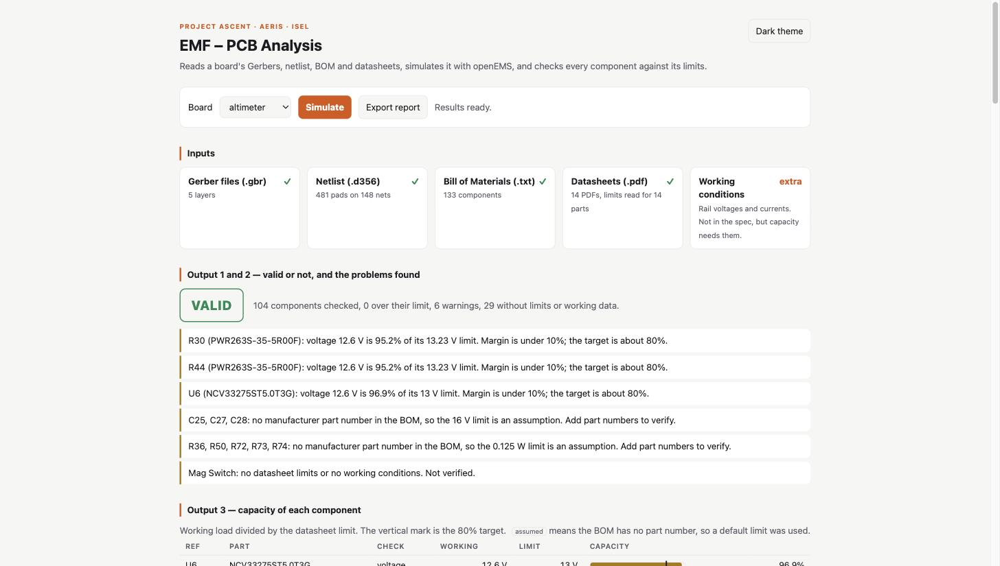
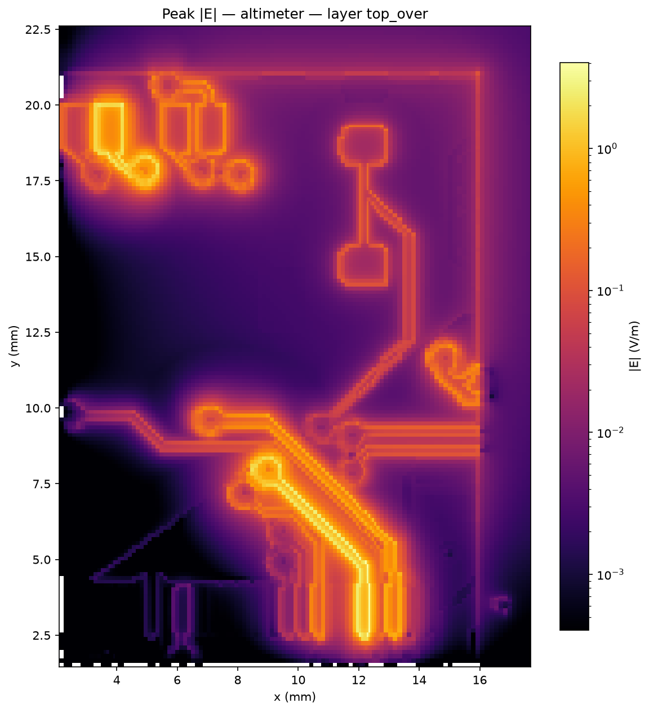

# AERIS EMF – PCB Analysis

A local tool that checks a circuit board design before it is manufactured. It reads the board's design files, simulates the electromagnetic field around its traces with [openEMS](https://www.openems.de/), and checks every component against the limits in its datasheet.

Built for Project Ascent (AERIS, ISEL). Spec: [`TOOL__1_AERIS.pdf`](TOOL__1_AERIS.pdf).



## What it does

| You give it | It uses it for |
| --- | --- |
| Gerber files `.gbr` | The copper shapes: board preview and the field simulation |
| Netlist `.d356` | Which net every component pin sits on, and where on the board |
| Bill of Materials `.txt` | The manufacturer part number of each component |
| Datasheets `.pdf` | Each part's voltage, current and power limits (read by AI, with the source page) |

| It gives you | Meaning |
| --- | --- |
| **Valid or not** | No component is pushed past its limit |
| **Problems** | One plain sentence per finding, e.g. "U6: voltage 12.6 V is 96.9 % of its 13 V limit" |
| **Capacity %** | Working load ÷ datasheet limit for every component. The target is about 80 % |
| **EMF map** | Colour map of where the electric field concentrates, per board layer |

An **Export report** button produces a printable report (save as PDF) with all inputs and results.



## Try it on the demo board

Requirements: macOS or Linux, [Docker Desktop](https://www.docker.com/products/docker-desktop/) running, [uv](https://docs.astral.sh/uv/).

```bash
# once: build the simulator image (compiles openEMS, takes 20–40 minutes)
git clone --depth 1 https://github.com/antmicro/gerber2ems.git vendor/gerber2ems
docker build -t gerber2ems -f Dockerfile vendor/gerber2ems

# start the app
uv run app.py        # opens http://127.0.0.1:8000
```

Pick **altimeter**. The inputs, verdict, problems, capacity table and copper layers show immediately. Press **Simulate** for the EMF map (about 10 minutes), then **Export report**.

The demo board is a real rocket avionics board: the SRAD Altimeter by Waterloo Rocketry (GPL-3.0). Details in [`boards/altimeter/README.md`](boards/altimeter/README.md). Its datasheet PDFs are not in this repository for copyright reasons; the limits already read from them are in `boards/altimeter/limits.json`, so the demo works without them.

## Using it on your own board

> **Status: possible, but not yet point-and-click.** The app has no upload screen. A board is a folder under `boards/`, and three of the steps below are manual. Expect about an hour for a first board.

**1. Export the design files** (automatic for KiCad projects)

```bash
./export_kicad.sh path/to/kicad_project project_name my_board
```

This writes the Gerbers, drill file, stackup, `netlist.d356` and `bom.txt` into `boards/my_board/`. It uses the `kicad/kicad:9.0` Docker image. For other CAD tools, export the same files by hand and follow the layout of `boards/altimeter/`.

**2. Add the datasheets** (manual download, automatic reading)

Put one PDF per part in `boards/my_board/datasheets/`, named after the BOM part number (`TLP3543A.pdf`). Then:

```bash
uv run extract_limits.py boards/my_board     # needs the `claude` CLI, logged in
```

Review `limits.json`. Each entry cites the datasheet page it came from.

**3. State the working conditions** (manual)

Create `boards/my_board/conditions.json` with the rail voltages and the current through the main components. Copy `boards/altimeter/conditions.json` as a template. Rails named like `+3V3` or `+12V` are read from the netlist automatically. None of the four design files carries this information, and capacity cannot be computed without it.

**4. Choose what to simulate** (manual, needs someone who knows the board)

A whole board is too heavy to simulate. Pick one critical net (fast or high-voltage) and describe it in three files, using `boards/altimeter/` as the template:

- `roi.json` — the rectangle around that net, in mm from the board's bottom-left corner. Re-run step 1 after creating it.
- `fab/<name>-top-pos.csv` — the two ends of the net (`SP1`, `SP2`), in mm from the rectangle's corner.
- `simulation.json` — frequency range, the net's name, trace width at the ports.

**5. Run it**

```bash
uv run app.py
```

Steps 1–3 alone already give the verdict, problems and capacity table. Step 4 is only needed for the EMF map.

### Not possible yet

- Uploading files through the app.
- Picking the net and its ports automatically from the netlist.
- More than one simulated net per board.
- Absolute field values for nets whose real signal is not a simple voltage swing.
- Hosting on the web: the simulator needs Docker and several CPU-minutes per run, so the app runs on your own machine.

## Command line

```bash
uv run extract_limits.py boards/altimeter          # datasheets -> limits.json
uv run analyze.py boards/altimeter                 # -> report.json, prints verdict and problems
./run.sh boards/altimeter                          # simulate + heatmap above the top copper
uv run heatmap.py boards/altimeter --layer F_Cu    # another layer, no re-simulation
```

## How the checks work

- **Voltage**: highest rail on a component's pins (or the difference across a 2-pin part) ÷ its rated voltage.
- **Current**: the current stated for that component in `conditions.json` ÷ its rated current.
- **Power**: I²R for resistors with a stated current, V²/R for the others ÷ rated power.
- **Capacity** is the worst of the three. Above 100 % is an error and makes the board not valid. Above 90 % is a warning.
- Rail voltages carry across fuses, ferrites, inductors and resistors of 10 Ω or less.
- Parts without a part number in the BOM fall back to `limits.json` → `defaults`, and are tagged *assumed*.
- **EMF**: the simulation drives one net with a test pulse. Fields scale linearly with voltage, so the map is scaled to the net's real voltage and compared with the breakdown strength of air (3 kV/mm) and FR4 (20 kV/mm).

## Project layout

| File | Role |
| --- | --- |
| `app.py`, `index.html` | Local web app |
| `analyze.py` | Parses netlist and BOM, runs the checks, writes `report.json` |
| `extract_limits.py` | Reads limits from datasheet PDFs |
| `heatmap.py` | Turns simulation dumps into field maps |
| `report_html.py` | Printable report |
| `export_kicad.sh` | KiCad project → board folder |
| `run.sh`, `Dockerfile` | Simulation from the command line; simulator image ([gerber2ems](https://github.com/antmicro/gerber2ems) + openEMS, with an arm64 fix and a region-of-interest patch) |
| `boards/altimeter` | Demo board with all four inputs |
| `boards/stub_short` | gerber2ems example trace, Gerbers only |

## Checks

```bash
uv run heatmap.py --selftest
uv run analyze.py --selftest
```

## Licenses of included material

`boards/altimeter` is derived from Waterloo Rocketry's [canhw](https://github.com/waterloo-rocketry/canhw) (GPL-3.0). `boards/stub_short` comes from [gerber2ems](https://github.com/antmicro/gerber2ems) (Apache-2.0).
